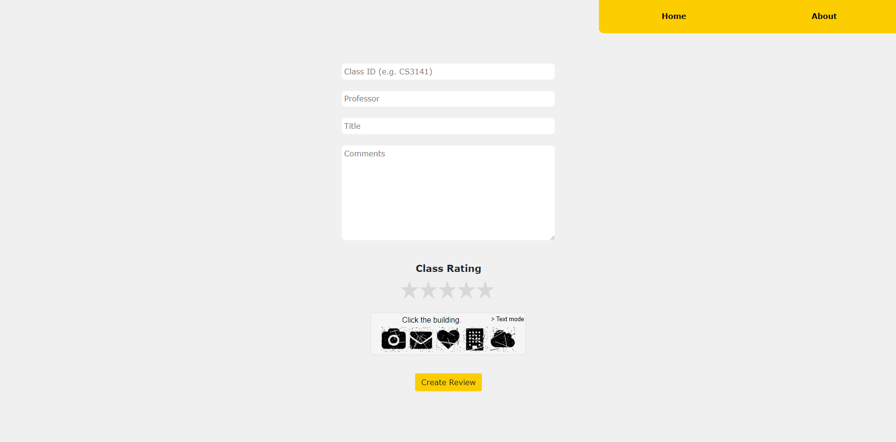
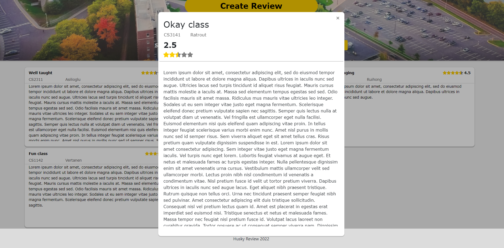
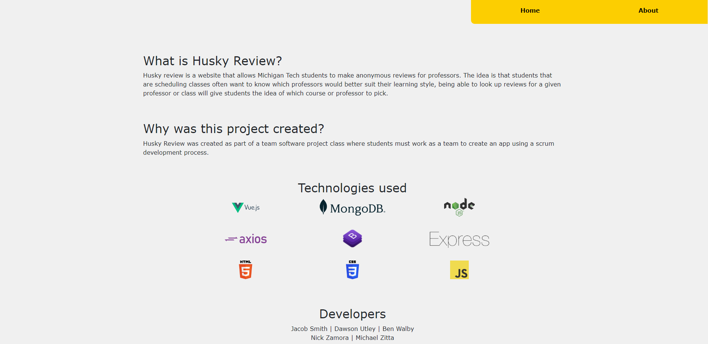
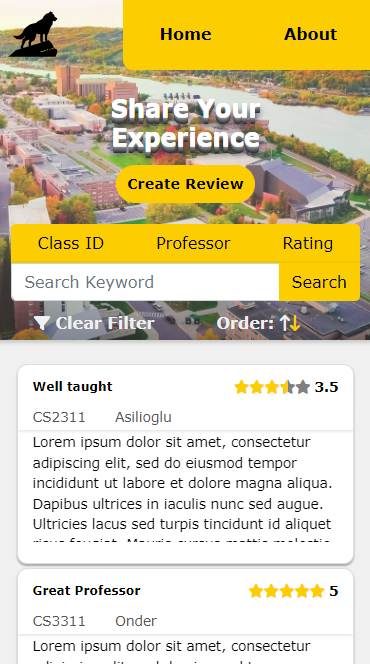
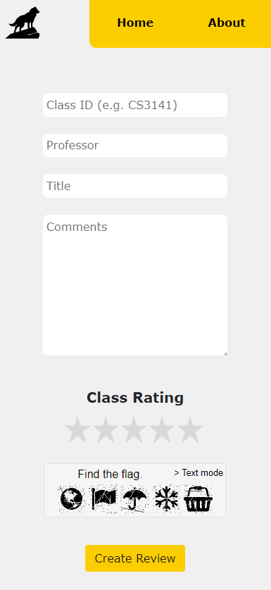
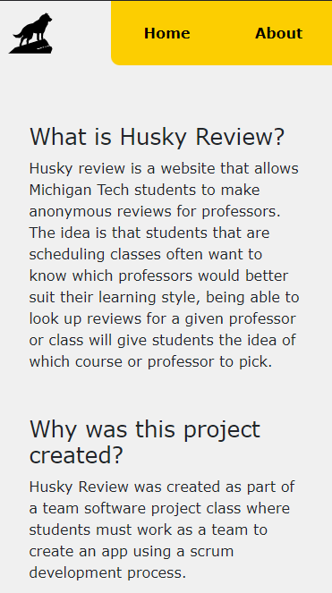

<h1><strong>Husky Review</strong></h1>

   

<h2><strong>Team Members</strong><h2>

| Roll# | Name | Position Title |
| --- | --- | --- |
| 42 | Nicholas Zamora | Developer |
| 43 | Michael Zitta | Developer |
| 39 | Dawson Utley | Developer |
| 37 | Jacob Smith | Developer |
| 40 | Ben Walby | Developer |

  

<h2><strong>Overview</strong></h2> 

Husky Review is a web application developed by a team of Michigan Tech students that was created using the MEVN stack. The application allows Michigan Tech students to create anonymous reviews for classes taught by certain professors. Once a review is created it will be dynamically loaded from the database and displayed on the home page along with all the other reivews. Users are able to sort/filter through the reviews via professor, rating, or keyword. The app is similar to Rate My Professors but exclusively for Michigan Tech students.

  

<h2><strong>Technologies Used</strong></h2> 

<ul>
<li>Vue.js</li>
<li>MongoDB</li>
<li>Node.js</li>
<li>Axios</li>
<li>Bootstrap</li>
<li>Express</li>
<li>GitHub</li>
<li>Trello</li>
<li>VS Code</li>
<li>Gimp</li>
<li>Inkscape</li>
</ul>

 

<h3><strong>What Went Well?</strong></h3>

Overall the project was completed in time with all initial goals being met with additional features being added as well. The UI was responsive, looked good, and was functional both
on desktop and mobile. The team was able to adapt and quickly learn new technologies that many of the members had no prior experience with to meet goals.
 

<h3><strong>What Could Be Improved?</strong></h3>

After completing the project we had some time to think and relized that a user login system would be highly beneficial for the app. The issue with not having a login is that a user is 
unable to delete a review once it is made and would have to be delted by an admin. A login system was not an initial goal as we wanted the reviews to be anonymous. Another issue that was discoverd on the last day of development was a bug related to submitting a review. What seemed to cause the bug was the user spamming the submit button causing multiple entries with the same primary key to be sent to the database. This bug was unable to be reliably be reproduced.
 

<h3><strong>Main Takeaways</strong></h3>
<table>
<tr>
<th >
The Good
</th>
<th>
The Bad
</th>
</tr>
<tr>
<td>
<ul>
<li>Learned a lot about Vue.js</li>
<li>Unique Design</li>
<li>Application is Responsive</li>
</ul>
</td>

<td>
<ul>
<li>No user accounts</li>
<li>Rare submission bug</li>
<li>Submission loading time</li>
</ul>
</td>
</tr>
</table>

<h2><strong>Screenshots</strong></h2>

<h2 align="center">Desktop Views</h2> 
 
 
 
 
 

<h2 align="center">Mobile Views</h2> 

 

 

 
